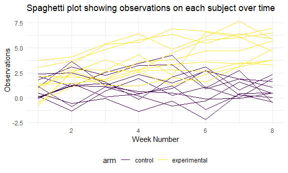

Homework 5 solutions
================
Yanhao Li
11/18/2020

### Problem 1

Describe the raw data.

``` r
homicide_df = 
  read_csv("homicide_data/homicide-data.csv") %>% 
  mutate(
    city_state = str_c(city, state, sep = "_"),
    resolved = case_when(
      disposition == "Closed without arrest" ~ "unsolved",
      disposition == "Open/No arrest" ~ "unsolved",
      disposition == "Closed by arrest" ~ "solved"
    )
  ) %>% 
  select(city_state, resolved) %>% 
  filter(city_state != "Tulsa_AL")
```

    ## 
    ## -- Column specification --------------------------------------------------------
    ## cols(
    ##   uid = col_character(),
    ##   reported_date = col_double(),
    ##   victim_last = col_character(),
    ##   victim_first = col_character(),
    ##   victim_race = col_character(),
    ##   victim_age = col_character(),
    ##   victim_sex = col_character(),
    ##   city = col_character(),
    ##   state = col_character(),
    ##   lat = col_double(),
    ##   lon = col_double(),
    ##   disposition = col_character()
    ## )

Let’s look at this a bit.

``` r
aggregate_df = 
  homicide_df %>% 
  group_by(city_state) %>% 
  summarize(
    hom_total = n(),
    hom_unsolved = sum(resolved == "unsolved")
  )
```

    ## `summarise()` ungrouping output (override with `.groups` argument)

Test Baltimore, MD and get data.

``` r
prop.test(
  aggregate_df %>% filter(city_state == "Baltimore_MD") %>% pull(hom_unsolved), 
  aggregate_df %>% filter(city_state == "Baltimore_MD") %>% pull(hom_total)
  ) %>% 
  broom::tidy()
```

    ## # A tibble: 1 x 8
    ##   estimate statistic  p.value parameter conf.low conf.high method    alternative
    ##      <dbl>     <dbl>    <dbl>     <int>    <dbl>     <dbl> <chr>     <chr>      
    ## 1    0.646      239. 6.46e-54         1    0.628     0.663 1-sample~ two.sided

Test each of the cities in dataset and get data.

``` r
results_df = 
  aggregate_df %>% 
  mutate(
    prop_tests = map2(.x = hom_unsolved, .y = hom_total, ~prop.test(x = .x, n = .y)),
    tidy_tests = map(.x = prop_tests, ~broom::tidy(.x))
  ) %>% 
  select(-prop_tests) %>% 
  unnest(tidy_tests) %>% 
  select(city_state, estimate, conf.low, conf.high)
```

Create a plot.

``` r
results_df %>% 
  mutate(city_state = fct_reorder(city_state, estimate)) %>% 
  ggplot(aes(x = city_state, y = estimate)) +
  geom_point() +
  geom_errorbar(aes(ymin = conf.low, ymax = conf.high)) +
  theme(axis.text.x = element_text(angle = 90, vjust = 0.5, hjust = 1))
```


### Problem 2

Create a tidy dataframe.

``` r
path_df =  
  tibble(
    path = list.files("lda_data")
  ) %>% 
  mutate(
    path = str_c("lda_data/", path),
    data = map(.x = path, ~read_csv(.x))
    ) %>% 
  separate(
    path,
    into = c("folder_name", "arm", "dash", "subject_id", "file_type"),
    sep = c(9, 12, 13, 15)
  ) %>% 
  select(-folder_name, -file_type, -dash) %>% 
  unnest(data) %>% 
  pivot_longer(
    week_1:week_8,
    names_prefix = "week_",
    names_to = "week_number",
    values_to = "observations"
  ) %>% 
  mutate(
    arm = case_when(
      arm == "con" ~ "control",
      arm == "exp" ~ "experimental"
    ),
    week_number = as.numeric(week_number)
  )
```

Make a spaghetti plot.

``` r
path_df %>% 
  mutate(
    arm_sub_id = str_c(arm, subject_id, sep = "_")
  ) %>% 
  ggplot(aes(x = week_number, y = observations, group = arm_sub_id, color = arm)) +
  geom_line() +
  labs(
    title = "Spaghetti plot showing observations on each subject over time",
    x = "Week Number",
    y = "Observations"
    )
```



According to the spaghetti plot, experimental group has a general trend
of increment, while control group does not. In week eight, all
observations of experimental group are higher than those of control
group.

### Problem 3

Set mu = 0. Generate 5000 datasets from the model. Save data.

``` r
sim_test = function(sample_size = 30, mu, sigma = 5) {
  
  sim_data = 
    tibble(
      x = rnorm(n = sample_size, mean = mu, sd = sigma)
    )

  sim_data %>% 
    t.test(
      alternative = "two.sided", 
      conf.level = 0.95
      ) %>% 
    broom::tidy() %>% 
    select(estimate, p.value)
  
}

output_mu0 = vector("list", length = 5000)

for (i in 1:5000) {
  
  output_mu0[[i]] = sim_test(mu = 0)
  
}

bind_rows(output_mu0)
```

    ## # A tibble: 5,000 x 2
    ##    estimate p.value
    ##       <dbl>   <dbl>
    ##  1   0.336    0.654
    ##  2  -0.133    0.885
    ##  3  -0.0949   0.924
    ##  4  -0.0240   0.978
    ##  5   0.242    0.787
    ##  6   0.226    0.834
    ##  7   0.478    0.633
    ##  8  -0.0877   0.918
    ##  9   0.258    0.729
    ## 10  -0.207    0.788
    ## # ... with 4,990 more rows

Repeat the above for mu = {1,2,3,4,5,6}.

``` r
output_mu1_6 = 
  tibble(
  mu = c(1:6)
) %>% 
  mutate(
    output_lists = map(.x = mu, ~ rerun(5000, sim_test(mu = .x))),
    estimate_df = map(output_lists, bind_rows)
  ) %>% 
  select(-output_lists) %>% 
  unnest(estimate_df)
```

Make a plot showing the proportion of times the null was rejected on the
y axis and the true value of mu on the x axis.

``` r
output_mu1_6 %>% 
  mutate(
    decision = case_when(
      p.value < 0.05 ~ "reject",
      p.value >= 0.05 ~ "fail to reject"
    )
  ) %>% 
  group_by(mu) %>%
  summarise(
    reject_prop = sum(decision == "reject")/5000
    ) %>% 
  ggplot(aes(x = mu, y = reject_prop)) +
  geom_point() +
  geom_line() +
  labs(
    title = "True value of mu vs Rejection proportion",
    x = "True value of mu",
    y = "Rejection proportion"
  )
```

    ## `summarise()` ungrouping output (override with `.groups` argument)


According to the plot, power increases as effect size increases.

Make a plot showing the average estimate of mu on the y axis and the
true value of mu on the x axis.

``` r
output_mu1_6 %>% 
  group_by(mu) %>%
  summarise(
    avg_samp_mean = mean(estimate)
    ) %>% 
  ggplot(aes(x = mu, y = avg_samp_mean)) +
  geom_point() +
  geom_line() +
  labs(
    title = "True value of mu vs Average estimate of mu",
    x = "True value of mu",
    y = "Average estimate of mu"
  )
```

    ## `summarise()` ungrouping output (override with `.groups` argument)


Make a second plot the average estimate of mu only in samples for which
the null was rejected on the y axis and the true value of mu on the x
axis.

``` r
output_mu1_6 %>% 
  mutate(
    decision = case_when(
      p.value < 0.05 ~ "reject",
      p.value >= 0.05 ~ "fail to reject"
    )
  ) %>% 
  group_by(mu) %>%
  filter(decision == "reject") %>% 
  summarise(
    avg_reject_mean = mean(estimate)
    ) %>% 
  ggplot(aes(x = mu, y = avg_reject_mean)) +
  geom_point() +
  geom_line() +
  labs(
    title = "True value of mu vs Average estimate of mu that rejected",
    x = "True value of mu",
    y = "Average estimate of mu that rejected"
  )
```

    ## `summarise()` ungrouping output (override with `.groups` argument)


The average estimates of mu that rejected get closer to the true values
of mu as effect size increases. Because power increases as effect size
increases, it is more likely to reject null when effect size is large.
In other words, amounts of mu that rejected get larger when effect size
increases, which the average estimates of mu that rejected approaches
average estimates of mu.
